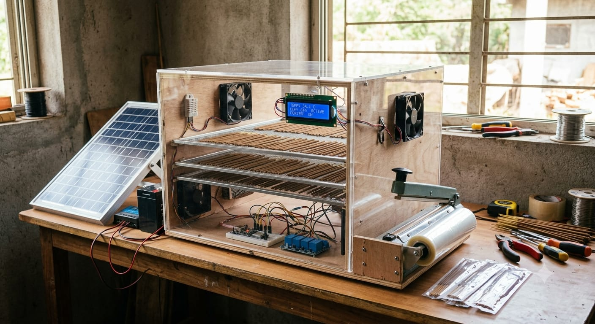
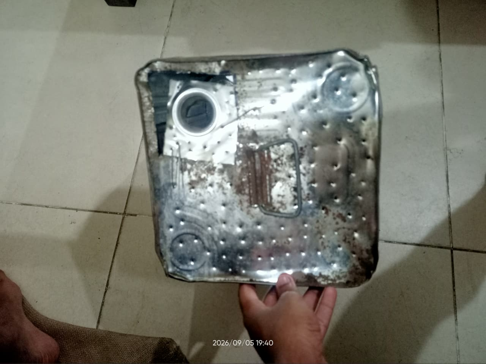
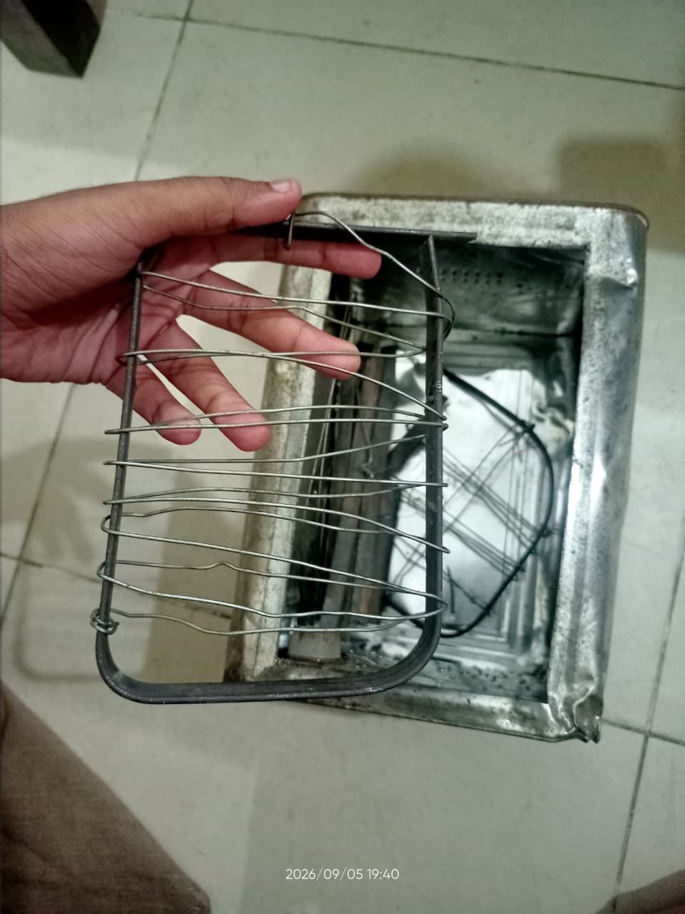
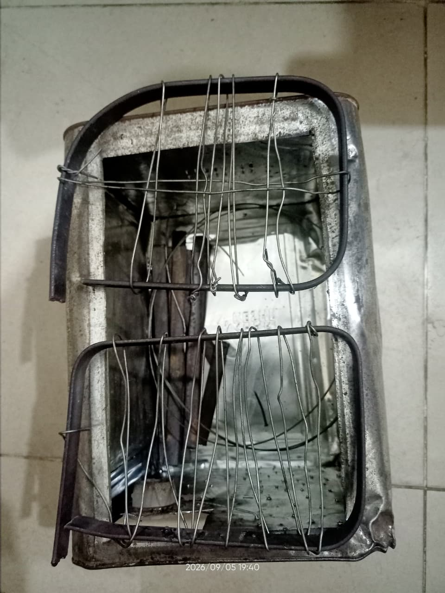

# ☀️ Solar-Powered Agarbatti Drying & Packaging System

A team-developed MVP concept for a **solar-powered drying and packaging system for home-based agarbatti manufacturing by rural women artisans**.

The project focuses on developing a compact, low-cost drying chamber with controlled airflow, temperature monitoring, thermal safety, and a simple packaging station.

## 🎯 Problem

Home-based agarbatti manufacturing can require practical and efficient drying and packaging methods. The proposed system aims to provide a compact solution that can be adapted for rural and small-scale production environments.

## 💡 Proposed Solution

The MVP combines:

* Solar-powered energy concept
* Two-tray drying chamber
* Controlled airflow using a DC fan
* Temperature and humidity monitoring
* ESP32-based control architecture
* Multi-layer thermal safety
* Manual weight-based packaging assistance

The initial design targets approximately **50–100 agarbatti sticks per drying cycle**.

## ⚙️ Drying Chamber

The proposed chamber consists of:

* Two aluminum wire-mesh drying trays
* Heating zone
* Air diffuser/plenum
* Bottom air intake
* Top exhaust
* Fan-assisted airflow
* Insulated/outer structural housing

The working temperature target of approximately **60°C is treated as a design hypothesis to be experimentally validated**, rather than a confirmed optimum.

## 🔌 Control & Monitoring

The planned control architecture uses an **ESP32** as the main controller.

### Sensors

* 2 × DS18B20 temperature sensors
* DHT22 temperature/humidity sensor

### Control

The planned firmware uses a state-based approach:

`IDLE → HEATING → MAINTAINING → COMPLETE`

with a separate `FAULT` state.

The heating system is intended to cycle around the target temperature while the fan provides controlled airflow and cooldown.

## 🛡️ Thermal Safety

The design incorporates multiple safety layers:

1. Software temperature control
2. Independent over-temperature cutoff
3. Physical thermal fuse

The proposed architecture includes an independent high-temperature cutoff and a physical non-resettable thermal fuse for additional protection.

> ⚠️ Mains/high-current sections require appropriate electrical isolation and safety precautions during construction.

## 📦 Packaging Station

The MVP also explores a simple semi-manual packaging system using:

* Poly/BOPP or HDPE pouch
* Lever-type impulse sealer
* Load cell
* HX711 load-cell amplifier

The intended workflow is:

`Tare → Add Agarbatti → Monitor Weight → Target Reached → Manual Sealing`

Automated bag advancement, sealing, labeling and conveyor mechanisms are outside the current MVP scope.

## ☀️ Power System

The project is designed around a solar-powered/off-grid concept.

The available solar panel for the prototype is a **75 W Tata BP Solar panel**.

For the internal prototype demonstration, a direct power-adapter supply was considered for the actual system operation while the solar panel demonstrates the intended off-grid concept.

Battery sizing and complete solar-power optimization remain future work.

## 💰 MVP Cost

The estimated combined MVP cost is approximately:

**₹3,200–₹5,750**

excluding the solar panel already available for the project.

The packaging station is estimated separately at approximately:

**₹650–₹1,250**

These are preliminary estimates for the prototype stage.

## 👨‍💻 My Contribution

**Hardware Design & Prototyping • Solution Planning • Presentation/PPT Review**

My responsibilities included:

* Working on the hardware-building aspect of the prototype
* Contributing to the planning and refinement of the proposed solution
* Reviewing and improving the project presentation/PPT
* Participating in discussions regarding the drying chamber and hardware architecture
* Contributing to the overall MVP planning

## 📌 Current Status

**MVP / Prototype Development**

The project is currently focused on developing and validating the prototype design.

Some elements of the architecture, including firmware implementation, heating-power optimization and complete solar-battery sizing, require further testing and development.

## 🚀 Future Scope

Potential future improvements include:

* Experimental validation of heating power
* Temperature optimization using real agarbatti batches
* Complete ESP32 firmware implementation
* Solar-battery sizing and optimization
* Improved insulation
* Automated packaging
* Automated counting
* Improved humidity-based drying completion detection
* Further reduction in manufacturing cost

## 📚 Project Context

This project was developed as part of a **team-based innovation/hackathon effort** addressing the problem of solar-powered drying and packaging for home-based agarbatti manufacturing.

---

**Project Type:** Hardware / Embedded Systems / Renewable Energy / Prototyping
**Development Stage:** MVP / Prototype
**Primary Areas:** Hardware Design • Embedded Systems • Solar Energy • Product Prototyping
## 🛠️ Prototype Development

### Conceptual Design

*AI-generated conceptual visualization of the proposed system. This image represents the intended design and is not a photograph of the physical prototype.*

### Physical MVP Prototype

*Early physical prototype using a repurposed metal container.*

*Hand-fabricated wire drying tray developed for the prototype.*

*Early two-tray drying chamber arrangement.*
